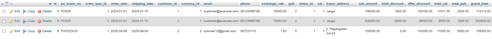
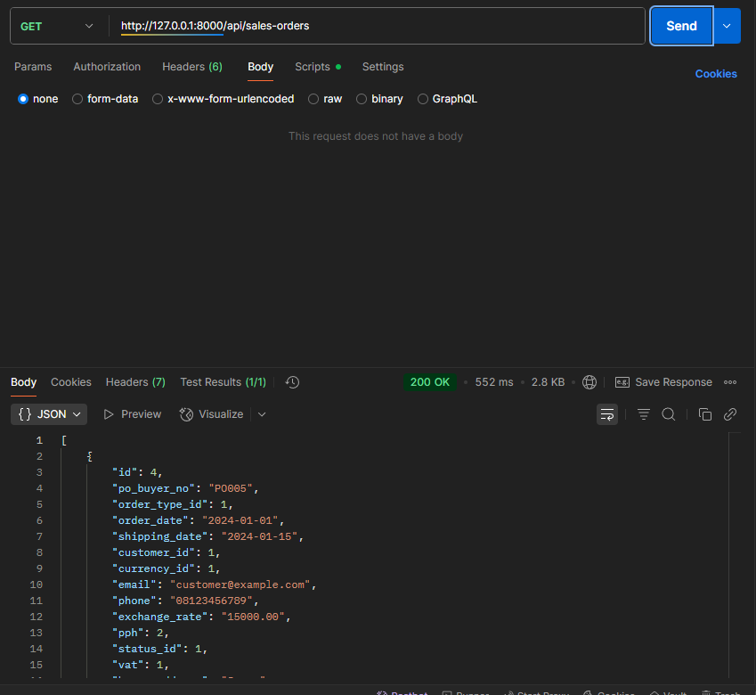
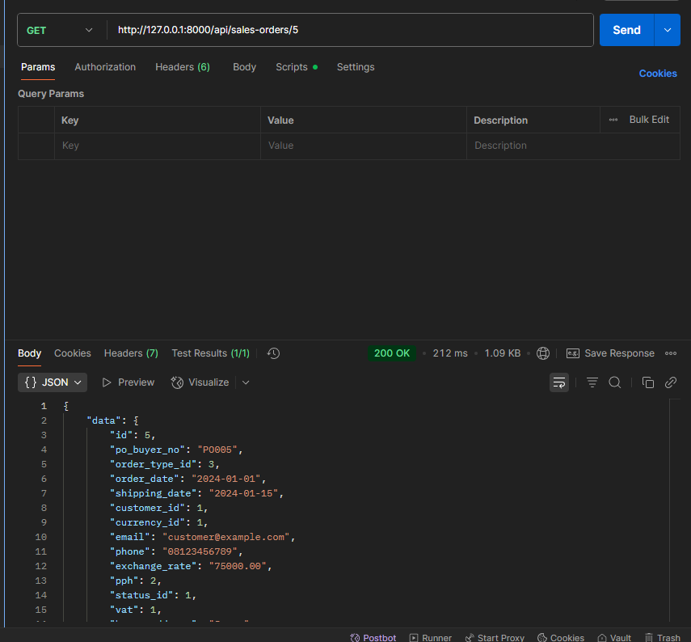
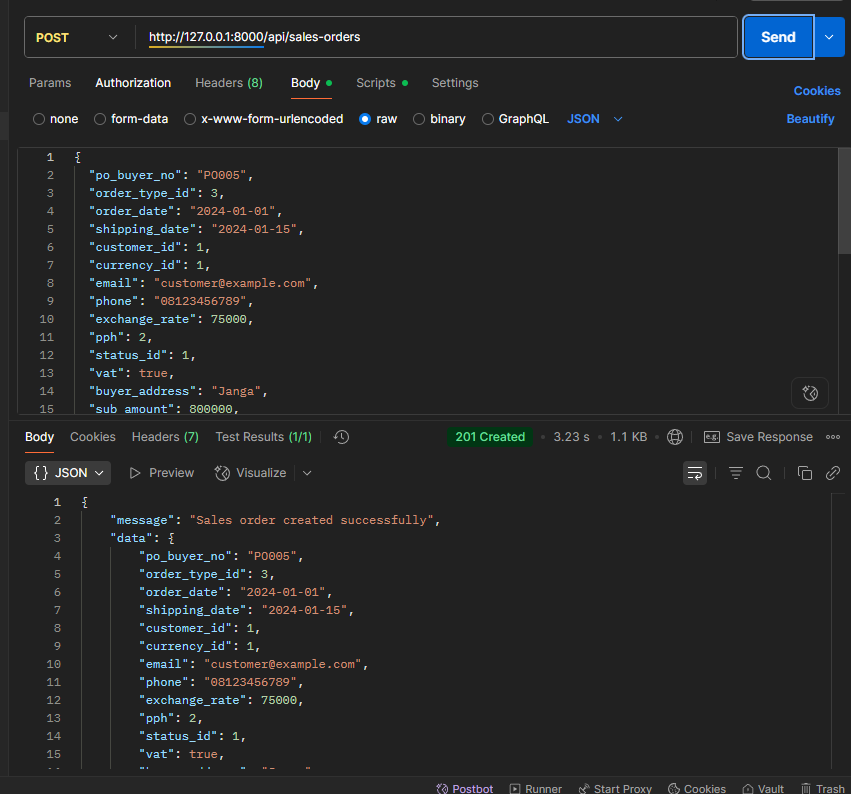
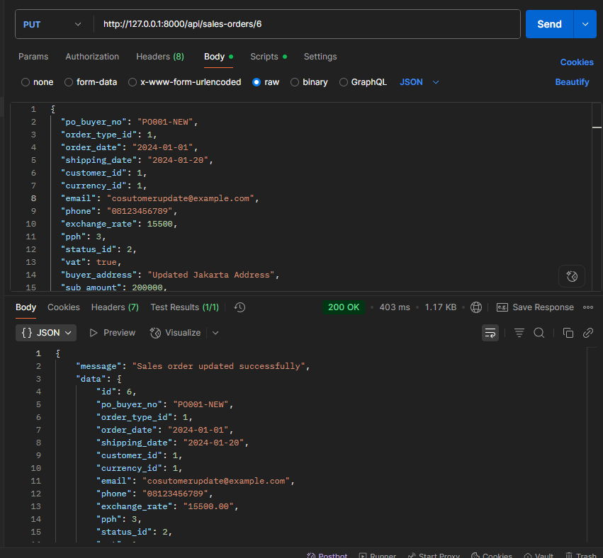
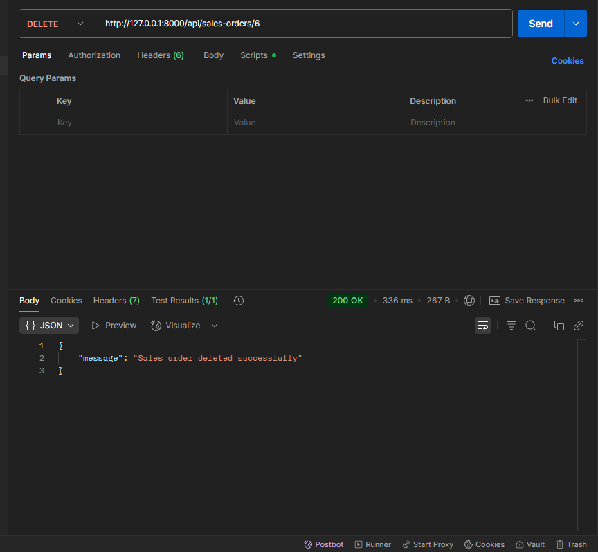

# Test Yubi BE

Backend project sales order menggunakan PHP (Laravel) dan MySQL sebagai database.

## Teknologi

-   PHP 8.2.12
-   Laravel Framework 12.22.1
-   MySQL untuk database relasional

## Instalasi & Setup

1. **Clone repository**

    ```bash
    git clone https://github.com/irsyad-hash/test-yubi-BE.git
    cd test-yubi-BE
    ```

2. **Install dependensi via Composer**

    ```bash
    composer install
    ```

3. **Setup environment**

    - Salin file `.env.example` menjadi `.env`
        ```bash
        cp .env.example .env
        ```
    - Atur detail koneksi database:
        ```env
        DB_HOST=127.0.0.1
        DB_PORT=3306
        DB_DATABASE=yubi_db
        DB_USERNAME=root
        DB_PASSWORD=
        ```

4. **Jalankan migrasi**

    ```bash
    php artisan migrate
    ```

5. **Jalankan server development**
    ```bash
    php artisan serve
    ```
    Aplikasi akan berjalan di `http://localhost:8000`

## Konfigurasi Database (MySQL)

Pastikan MySQL sudah berjalan dan kredensial di `.env` telah sesuai.  
Contoh konfigurasi:

```env
DB_CONNECTION=mysql
DB_HOST=127.0.0.1
DB_PORT=3306
DB_DATABASE=yubi_db
DB_USERNAME=root
DB_PASSWORD=
```

## Screenshoot

### Database



### Get Method



### Get by id Method



### Post Method



### Put Method (Update)



### Delete Method


